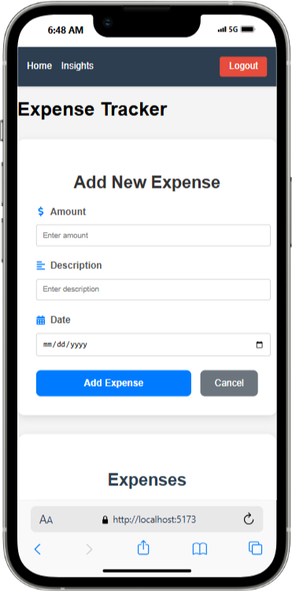

# Expense Tracker & Analyzer Client

## Overview

This is the frontend for the [**Expense Tracker & Analyzer application**](https://github.com/akinmiday/expense-tracker), which integrates with the backend API to provide a seamless user experience for tracking expenses, gaining spending insights, and managing financial activities. The frontend is built using **React**, **React Router**, and **Axios** for API communication, with **JWT-based authentication** and **DeepSeek AI integration** for intelligent expense categorization and financial analysis.

## Features

### User Authentication

- Register a new user.
- Login with email and password.
- Logout functionality.
- Protected routes for authenticated users.

### Expense Management

- Add new expenses with amount, description, and date.
- View a list of all expenses.

### Spending Insights

- Analyze spending within a specific date range.
- View total spending and category-wise breakdown.
- Access previous spending insights.

### AI Integration

- Automatically categorize expenses using **DeepSeek AI**.
- Generate AI-powered financial insights.

### Visualization

- Interactive bar charts for category-wise spending.
- Clean and responsive UI for a better user experience.

---

## Technologies Used

- **React**: Frontend library for building user interfaces.
- **React Router**: For routing and navigation.
- **Axios**: For making HTTP requests to the backend API.
- **Chart.js**: For visualizing spending data.
- **JWT Authentication**: Secure user authentication using JSON Web Tokens.
- **Context API**: For global state management (e.g., authentication state).
- **CSS Modules**: For styling components.

---

## Installation

### Prerequisites

Ensure you have the following installed:

- Node.js
- npm (Node Package Manager)

### Steps

#### Clone the Repository

```sh
  git clone https://github.com/akinmiday/expense-tracker-client.git
  cd expense-tracker-client
```

#### Install Dependencies

```sh
  npm install
```

#### Configure Environment Variables

Create a `.env` file in the root directory and add the following:

```env
VITE_API_BASE_URL=http://localhost:5000/api
```

#### Start the Development Server

```sh
  npm run dev
```

The application will be running on `http://localhost:5173`.

---

## Project Structure

```
expense-tracker-frontend/
│── src/
│   ├── components/          # Reusable components (e.g., Layout, ExpenseForm, ExpenseList)
│   ├── pages/               # Page components (e.g., Home, Insights, Login, Register)
│   ├── context/             # Context for global state (e.g., AuthContext)
│   ├── services/            # API service functions (e.g., api.ts)
│   ├── styles/              # CSS files for styling
│   ├── App.tsx              # Main application component
│   ├── main.tsx             # Entry point for the app
│── public/                  # Static assets
│── .env                     # Environment variables
│── package.json             # Project dependencies
│── README.md                # Project documentation
```

---

## API Integration

The frontend communicates with the backend API using Axios. Below are the key API endpoints used:

### **User Authentication**

- **Register**: `POST /api/users/register`
- **Login**: `POST /api/users/login`
- **Logout**: `POST /api/logout`

### **Expense Management**

- **Add Expense**: `POST /api/expenses`
- **Get Expenses**: `GET /api/expenses`

### **Spending Insights**

- **Get Insights**: `POST /api/expenses/insights`
- **Get Previous Insights**: `GET /api/expenses/insights/previous`

---

## Key Components

### 1. **AuthContext**

- Manages the authentication state (e.g., `isAuthenticated`, `user`).
- Provides login, logout, and registration functionality.

### 2. **PrivateRoute**

- Protects routes that require authentication (e.g., Home, Insights).
- Redirects unauthenticated users to the login page.

### 3. **ExpenseForm**

- A form for adding new expenses.
- Validates input fields and submits data to the backend.

### 4. **ExpenseList**

- Displays a list of all expenses.
- Fetches data from the backend on component mount.

### 5. **Insights**

- Allows users to analyze spending within a specific date range.
- Displays total spending, category-wise breakdown, and AI-generated insights.
- Includes an interactive bar chart for visualization.

### 6. **SpendingChart**

- A reusable component for rendering bar charts using **Chart.js**.

---

## Usage

1. **Register**: Navigate to `/register` to create a new account.
2. **Login**: Navigate to `/login` to log in with your credentials.
3. **Add Expenses**: On the **Home page** (`/`), use the form to add new expenses.
4. **View Expenses**: The **Home page** displays a list of all expenses.
5. **Analyze Spending**: Navigate to `/insights` to analyze spending within a specific date range.
   - View total spending, category-wise breakdown, and AI-generated insights.

---

## App Screenshots





## Contributing

Contributions are welcome! To contribute:

1. Fork the repository.
2. Create a new branch (`git checkout -b feature-name`).
3. Make your changes and commit (`git commit -m "Added feature"`).
4. Push to your branch (`git push origin feature-name`).
5. Open a pull request.

---

## License

This project is licensed under the **MIT License**.

---

## Contact

For any issues or questions, please create a GitHub issue or contact me via [X](https://x.com/akinmiday/).
